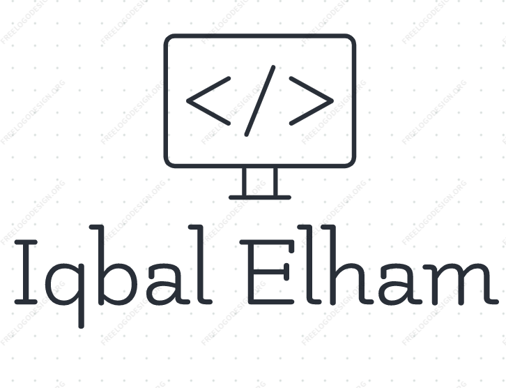

<a name="readme-top"></a>


<div align="center">

  
  <br/>

  <h3><b>Full Stack Developer</b></h3>

</div>

<!-- TABLE OF CONTENTS -->

# 📗 Table of Contents

- [📗 Table of Contents](#-table-of-contents)
- 📖Math Magicians
  - [🛠 Built With ](#-built-with-)
    - [Tech Stack ](#tech-stack-)
    - [Key Features ](#key-features-)
  - [🚀 Live Demo ](#-live-demo-)
  - [💻 Getting Started ](#-getting-started-)
    - [Prerequisites](#prerequisites)
    - [Setup](#setup)
    - [Install](#install)
    - [Usage](#usage)
    - [Run tests](#run-tests)
    - [Start the project](#start-the-project)
  - [👥 Author ](#-author-)
  - [🤝 Contributing ](#-contributing-)
  - [⭐️ Show your support ](#️-show-your-support-)
  - [🙏 Acknowledgments ](#-acknowledgments-)
  - [📝 License ](#-license-)

<!-- PROJECT DESCRIPTION -->

# 📖 [Math Magician] <a name="about-project"></a>


**[Math Magician]** is a Single Page JavaScript project, using React and ES6 features, and modules that let users do simple calculations.

## 🛠 Built With <a name="built-with"></a>

### Tech Stack <a name="tech-stack"></a>


  <ul>
    <li><a href="https://reactjs.org/">HTML</a></li>
    <li><a href="https://reactjs.org/">CSS</a></li>
    <li><a href="https://reactjs.org/">JavaScript</a></li>
    <li><a href="https://reactjs.org/">React</a></li>
  </ul>


<!-- Features -->

### Key Features <a name="key-features"></a>

- **Dynamic content using JavaScript**


<p align="right">(<a href="#readme-top">back to top</a>)</p>

<!-- LIVE DEMO -->

## 🚀 Live Demo <a name="live-demo"></a>


- [Math-magicians](https://math-magic-omhe.onrender.com)

<p align="right">(<a href="#readme-top">back to top</a>)</p>

<!-- GETTING STARTED -->

## 💻 Getting Started <a name="getting-started"></a>

To get the content of this project locally you need to run the following commands in your terminal:

and follow these steps.

### Prerequisites

- IDE(code editor) like: **Vscode**, **Sublime**, etc. 
- [Git](https://www.linode.com/docs/guides/how-to-install-git-on-linux-mac-and-windows/) 

### Setup

Clone this repository to your desired folder:

1. Download the **Zip** file or clone the repo with:
```bash git clone https://github.com/Iqbal-Elham/Math-Magician.git ``` 
2. To access cloned directory run: 
```bash cd math-magician ``` 
3. Open it with the live server 

### Install

> To install linters and other project's dependencies run:
```bash npm install ```

### Usage

To run the project, execute the following command:


### Run tests

To run tests, run the following command:

Test for Linters For tracking linter errors locally you need to follow these steps: 
1. For tracking linter errors in HTML files run:
```bash npx hint . ``` 
2. For tracking linter errors in CSS or SASS files run:
```bash npx stylelint "**/*.{css,scss}" ``` 
3. For tracking linter errors in javascript files run:
```bash npx eslint . ``` 

### Start the project

Enter the follow code to run the project locally:

`cd math-magician` then you can run `npm start` ; the project will run on port `3000`.

<p align="right">(<a href="#readme-top">back to top</a>)</p>

<!-- AUTHORS -->

## 👥 Author <a name="authors"></a>


👤 **Iqbal Elham**

- GitHub: [@iqbal-elham](https://github.com/Iqbal-Elham)
- linkedIn: [@iqbal-elham](https://www.linkedin.com/in/iqbal-elham-8830aa19a/)

<p align="right">(<a href="#readme-top">back to top</a>)</p>

<!-- CONTRIBUTING -->

## 🤝 Contributing <a name="contributing"></a>

Contributions, issues, and feature requests are welcome!

Feel free to check the [issues page](../../issues/).

<p align="right">(<a href="#readme-top">back to top</a>)</p>

<!-- SUPPORT -->

## ⭐️ Show your support <a name="support"></a>

Give a ⭐️ if you like this project!

<p align="right">(<a href="#readme-top">back to top</a>)</p>

<!-- ACKNOWLEDGEMENTS -->

## 🙏 Acknowledgments <a name="acknowledgements"></a>

A great thanks to Microverse.

<p align="right">(<a href="#readme-top">back to top</a>)</p>

<!-- LICENSE -->
## 📝 License <a name="license"></a>

This project is [MIT](./MIT.md) licensed.

<p align="right">(<a href="#readme-top">back to top</a>)</p>
